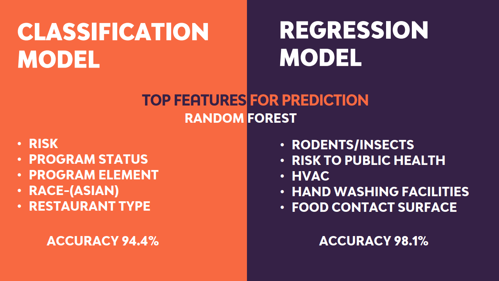
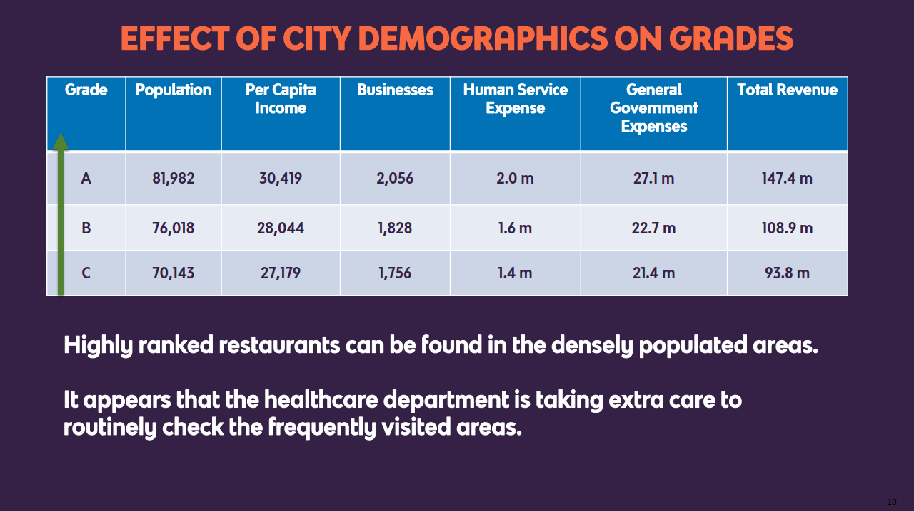
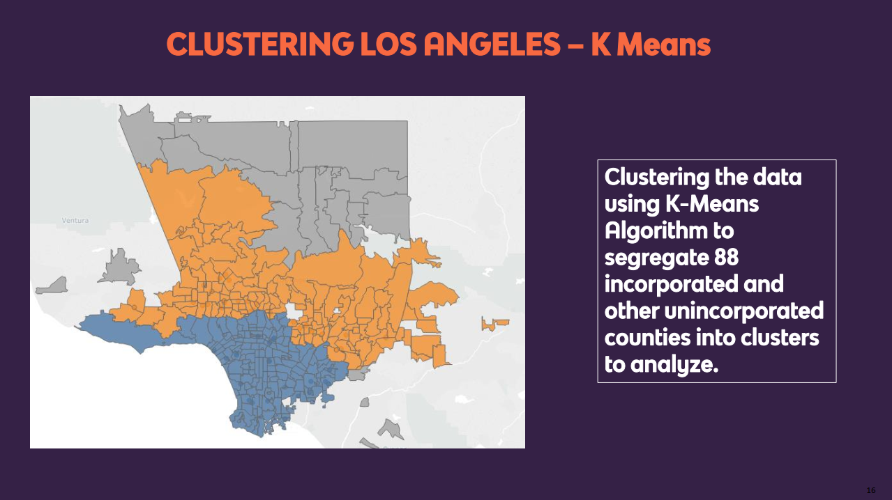

[](#technologies-and-tools)


# Los Angeles Restaurant Data Analysis and Predict
> An analysis of the inspection data of the restaurants in the 88 cities of Los Angeles county.
The project was done as part of INFORMS Analytics Challenge at the University of Texas at Dallas. The entire summary of the project can be found in the [project report](https://github.com/ashish1993utd/Los-Angeles-Restaurant-Data-Analysis-and-Prediction/blob/master/Team%20Linear%20Digressors-Final.pdf).

## Table of contents
* [General info](#general-info)
* [Screenshots](#screenshots)
* [Technologies and Tools](#technologies-and-tools)
* [Setup](#setup)
* [Code Examples](#code-examples)
* [Features](#features)
* [Status](#status)
* [Inspiration](#inspiration)
* [Contact](#contact)

## General info
The data provided was published by the city of Los Angeles on Environment Health inspection and enforcement results from restaurants in the Los Angeles county. These data cover 85 of 88 cities and all
unincorporated areas in the LA county. We have analyzed the data to answer 5 questions asked in the competition. We have also made a model to predict the health grade of the restaurant using only its address.

## Screenshots





**The entire presentation of the project can be found [here](https://github.com/ashish1993utd/Los-Angeles-Restaurant-Data-Analysis-and-Prediction/blob/master/Team%20Linear%20Digressors-Final.pdf).**

## Technologies and Tools
* Python
* Tableau 
* Microsoft Excel

## Setup

There are two datasets available: 
(i) market inspection dataset: contains results of inspection;
(ii) market violations dataset: contains information on health code violations in restaurants.
The data was sourced in February 2019 and has data till January 16, 2019. Data can be downloaded from 
[inspection data](https://data.lacounty.gov/Health/LOS-ANGELES-COUNTY-RESTAURANT-AND-MARKET-INSPECTIO/6ni6-h5kp) and [violations data](https://data.lacounty.gov/Health/LOS-ANGELES-COUNTY-RESTAURANT-AND-MARKET-VIOLATION/8jyd-4pv9).

The [code](https://github.com/ashish1993utd/Los-Angeles-Restaurant-Data-Analysis-and-Prediction/blob/master/Code/Naive%20Bayes%20Classification.ipynb) can be used to replicate the results. 
The tableau visualizations can be found [here](https://github.com/ashish1993utd/Los-Angeles-Restaurant-Data-Analysis-and-Prediction/blob/master/Tableau%20Visualizations/).


## Code Examples
Some examples of usage:

````
Naive Bayes Classification

  def train(self,dataset,labels):
        
  
        self.examples=dataset
        self.labels=labels
        self.bow_dicts=np.array([defaultdict(lambda:0) for index in range(self.classes.shape[0])])
        
        #only convert to numpy arrays if initially not passed as numpy arrays - else its a useless recomputation
        
        if not isinstance(self.examples,np.ndarray): self.examples=np.array(self.examples)
        if not isinstance(self.labels,np.ndarray): self.labels=np.array(self.labels)
            
        #constructing BoW for each category
        for cat_index,cat in enumerate(self.classes):
          
            all_cat_examples=self.examples[self.labels==cat] #filter all examples of category == cat
            
            #get examples preprocessed
            
            cleaned_examples=[preprocess_string(cat_example) for cat_example in all_cat_examples]
            
            cleaned_examples=pd.DataFrame(data=cleaned_examples)
            
            #now costruct BoW of this particular category
            np.apply_along_axis(self.addToBow,1,cleaned_examples,cat_index)
            
                      
        prob_classes=np.empty(self.classes.shape[0])
        all_words=[]
        cat_word_counts=np.empty(self.classes.shape[0])
        for cat_index,cat in enumerate(self.classes):
           
            #Calculating prior probability p(c) for each class
            prob_classes[cat_index]=np.sum(self.labels==cat)/float(self.labels.shape[0]) 
            
            #Calculating total counts of all the words of each class 
            count=list(self.bow_dicts[cat_index].values())
            cat_word_counts[cat_index]=np.sum(np.array(list(self.bow_dicts[cat_index].values())))+1 # |v| is remaining to be added
            
            #get all words of this category                                
            all_words+=self.bow_dicts[cat_index].keys()
                                                     
        
        #combine all words of every category & make them unique to get vocabulary -V- of entire training set
        
        self.vocab=np.unique(np.array(all_words))
        self.vocab_length=self.vocab.shape[0]
                                  
        #computing denominator value                                      
        denoms=np.array([cat_word_counts[cat_index]+self.vocab_length+1 for cat_index,cat in enumerate(self.classes)])                                                                          
      

        
        self.cats_info=[(self.bow_dicts[cat_index],prob_classes[cat_index],denoms[cat_index]) for cat_index,cat in enumerate(self.classes)]                               
        self.cats_info=np.array(self.cats_info)                                 
                                              
                                              

   
    def test(self,test_set):
      

        predictions=[] #to store prediction of each test example
        for example in test_set: 
                                              
            #preprocess the test example the same way we did for training set exampels                                  
            cleaned_example=preprocess_string(example) 
             
            #simply get the posterior probability of every example                                  
            post_prob=self.getExampleProb(cleaned_example) #get prob of this example for both classes
            
            #simply pick the max value and map against self.classes!
            predictions.append(self.classes[np.argmax(post_prob)])
                
        return np.array(predictions)

````

````
nb=NaiveBayes(np.unique(train_labels)) #instantiate a NB class object
print ("---------------- Training In Progress --------------------")
 
nb.train(train_data,train_labels) #start tarining by calling the train function
print ('----------------- Training Completed ---------------------')


pclasses=nb.test(test_data) #get predcitions for test set

#check how many predcitions actually match original test labels
test_acc=np.sum(pclasses==test_labels)/float(test_labels.shape[0]) 

print ("Test Set Examples: ",test_labels.shape[0]) # Outputs : Test Set Examples:  1502
print ("Test Set Accuracy: ",test_acc*100,"%") # Outputs : Test Set Accuracy:  93.8748335553 %

````


## Features
We have tried to answer the following questions in our analysis:

* What are the key factors in predicting health “scores” of the restaurants in Los Angeles county?
* What are the most important factors in classifying restaurants into different “grades”?
* Are there any relationships between various types of health code violations and scores/grades of a restaurant?
* Are there any patterns in terms of how health scores of restaurants change over time?

## Status
Project is: _finished_. Our team was the winner of the INFORMS Analytics Challenge 2019. Our college, [The University of Texas at Dallas](https://www.utdallas.edu/) has published an [article](http://bit.ly/2xkfs0U) detailing the account of the competitions win by our team "Linear Digressors". 

## Inspiration
The cover photo of the Presentation template is to replicate the Los-Angeles skyline. 
[Los Angeles skyline silhouette design](https://www.vexels.com/vectors/preview/79018/los-angeles-skyline-silhouette-design) | designed by Vexels

## Contact
Created by me and my teammate [Siddharth Oza](https://github.com/siddharthoza), and [Harsh Gupta](https://github.com/harshbg).

If you loved what you read here and feel like we can collaborate to produce some exciting stuff, or if you
just want to shoot a question, please feel free to connect with me on 
<a href="https://bit.ly/2YyG89N" target="_blank">LinkedIn</a>

[](https://github.com/ashish1993utd)
